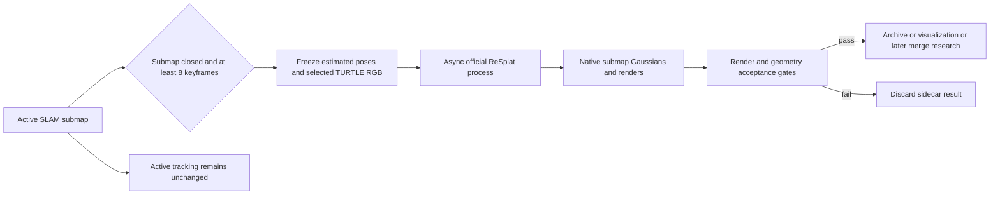
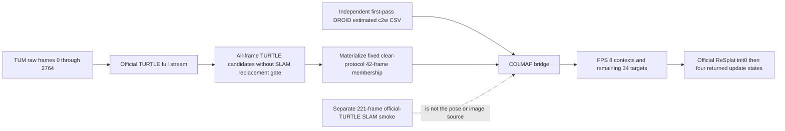

# Unblur-SLAM：官方 TURTLE + 官方 ReSplat 完整架构与审查规范

版本：`external-review-v2`  
日期：2026-08-22  
代码基线：branch `codex/framecrafter-resplat-streaming`，Git HEAD `b8d448462fc8be67d09924437eb3f478e32c42d4`，外加本文末尾逐文件 SHA-256 锁定的未提交实现。

> 本文把“目标架构”“当前已实现部分”“实验结果”和“尚不可声称的部分”分开描述。它可以直接交给第三方做代码、模型、实验协议和论文表述审查。

## 1. 一句话结论

本方案的正确技术路线是：

1. 用官方 TURTLE 取代单图 EVSSM，按输入帧顺序维护官方 K/V 状态，形成真正无未来帧的流式视频去模糊前端；
2. 在 ReplicaBlurry 配对数据上对 TURTLE 的历史注意力模块做低学习率、整序列 BPTT 微调；
3. Unblur-SLAM 在线阶段继续使用 DROID/Omnidata/高斯优化，并让 TURTLE 在每个源帧上更新状态；
4. 离线阶段可把最终估计相机和去模糊图像送给官方 cvg/ReSplat，运行其初始化和 4 次官方 recurrent update；
5. 官方 ReSplat 当前不能直接读取或细化 Unblur-SLAM 已经 densify/prune 后的任意 26K Gaussian 状态，因此它目前只能作为并行的终端神经重建后端，不能表述成“26K map 原状态再由官方 ReSplat 加速细化”；
6. TURTLE 三 seed 时序微调已跑通，但没有通过预注册的顺序增益门槛；另一次不读取 clear-GT membership 的 motion-only smoke 已完成。官方 ReSplat 已同时跑通终端重建和 closed-submap 异步 sidecar 接口，但 active-map merge 仍明确禁止。完整系统尚不能宣称已经使 SLAM 更稳。

## 2. 名称与边界

| 名称 | 本文精确定义 | 是否官方模型 | 当前状态 |
|---|---|---:|---|
| `EVSSM` | Unblur-SLAM 原单图去模糊器 | 是原项目模型 | 保留作基线，不是目标视频前端 |
| `causal-EVSSM` | 冻结 EVSSM 后接自研时序残差 adapter | 否 | 历史收益未过门，退出主方案 |
| `official TURTLE` | Ascend-Research/Turtle 官方网络、GoPro 配置与 K/V 递归状态 | 是 | 已接入、已运行、已微调 smoke |
| `legacy residual replay` | 本仓库曾实现的 residual-priority 视角采样器 | 否 | 仅历史 ablation；不得称 ReSplat |
| `official ReSplat` | cvg/resplat 的 recurrent Gaussian initializer/refiner | 是 | 已作为独立 sidecar 跑通 |
| `26K refinement` | Unblur-SLAM 原高斯场景参数的 26,000 次常规优化 | 原项目流程 | 官方 ReSplat 不能直接接管其状态 |

本文中不再使用“causal-EVSSM”代表最终视频去模糊方案。正确名称为：

> **Official TURTLE streaming frontend, GoPro initialized, ReplicaBlurry fine-tuned.**

## 3. 目标总体架构图

下图是希望最终形成的端到端架构，**不是本次已有 ReSplat sidecar 工件的数据谱系图**。当前工件的真实谱系见 §11.3；两者必须分开审查。

```mermaid
flowchart LR
    A[TUM or Replica raw RGB stream] --> B[Camera preprocessing]
    B --> C[Official TURTLE current-frame forward]
    S[Persistent official K and V state] --> C
    C --> S
    C --> D[Deblurred candidate]
    B --> E[Raw candidate]
    D --> F[No-GT safety and replacement gate]
    E --> F
    F --> G[DROID tracking and keyframe selection]
    G --> H[Omnidata depth prior]
    G --> I[Online Gaussian mapper]
    H --> I
    I --> J[Online ordinary Adam refinement]
    J --> K[Final DROID BA and camera set]
    K --> L[Standard Unblur-SLAM 26K Gaussian refinement]

    K -. estimated c2w only .-> M[Audited COLMAP scene export]
    F -. selected RGB raw or TURTLE .-> M
    M --> N[Official ReSplat initializer]
    N --> O[Exact init seed plus condition features]
    O --> P[Official forward_update x4]
    P --> Q[Native gsplat renders and native Gaussian state]

    L -. separate scene states and no state import .-> Q
```



图中最重要的边界是最后一条虚线：当前官方 ReSplat 接收的是它自己的 initializer 输出和 condition features，不是 Unblur-SLAM 的 26K GaussianModel。

## 4. 设计目标与非目标

### 4.1 设计目标

- 视频前端必须严格因果：时刻 `t` 的输出只依赖 `0..t`；
- 视频前端必须在所有源帧上更新状态，即使该帧最终不成为 SLAM keyframe；
- 去模糊输出是否进入 tracking 必须使用不含 GT 的安全门；
- 去模糊训练必须使用 ReplicaBlurry 的 blurry/sharp 配对监督，不读取 SLAM pose、depth 或 clear-GT 评估列表；
- 历史贡献必须用同 checkpoint 的 `normal vs reset/repeat/shuffle` 对照验证；
- ReSplat 必须直接调用官方代码、官方 checkpoint 和官方 recurrent update；
- 未来正式论文实验中，GT 只能进入冻结输出后的离线指标计算，不能进入上下文选择、pose、模型输入或阈值调参；
- 所有关键 repo、checkpoint、manifest、脚本与结果均用完整 SHA-256 绑定。

### 4.2 当前明确不是目标的内容

- 不把自研 residual replay 重命名为 ReSplat；
- 不把单图 EVSSM 称为因果视频模型；
- 不把 ReSplat 新建的 Gaussian 场景称为对 26K 原场景状态的原位 refinement；
- 不在一个 validation seed 上看到小幅提升后就打开 Room2、TUM 或改变阈值；
- 未来正式论文实验不用 clear-GT frame list 选择 context、keyframe 或 checkpoint；本次 TUM 42-frame sidecar smoke 不满足这一项，必须按 §11.3 披露为 clear-GT-membership-conditioned protocol；
- 不把接口 smoke 当成论文完整 26K 指标。

## 5. 模块分层

### 5.1 L0：输入与相机预处理

TUM `freiburg2_xyz` 的锁定空间合同为：

```text
raw RGB 640x480
  -> OpenCV undistort，使用原始 K 与 distortion
  -> INTER_LINEAR resize 到 528x400
  -> 左/右/上/下各 crop 8
  -> RGB 512x384，float32 [0,1]
```

处理后内参为：

```text
K = [[429.7425,          0, 260.2075],
     [        0, 434.166667, 200.083333],
     [        0,          0,          1]]
```

这一路径已在 42 个 TUM clear-reference 帧上逐像素核对，预处理图与评估左半幅完全一致。禁止把直接 resize 到 `512x384` 的图与上述 tracker-crop 图共用一个 K。

### 5.2 L1：官方 TURTLE 流式视频前端

固定上游资产：

| 资产 | 固定值 |
|---|---|
| 官方仓库 | `/srv/szha0669/unblur-slam/external/TURTLE` |
| commit | `7094f4221b64ad0962b4f27ff1b76d788836e804` |
| 架构 SHA-256 | `4d19c676f92574dbad493eb591312fdeaf2b3b519f57410af2ed95fdbef5f058` |
| GoPro 配置 SHA-256 | `123b07de8d3f329769562e2f943e08fdf86c576c405634bad199ced95b25aa23` |
| GoPro 权重 SHA-256 | `10334b3e81d0416bcde5ccaca960dc81dbfb5b6d23e53fadaf7896d72b580c82` |
| 参数量 | `59,079,548` |

官方 `Turtle_t1` 主体结构：

```text
current RGB
  -> 3x3 Conv, 3 to 64
  -> Encoder L1: 64 channels, 2 ReducedAttn blocks
  -> Encoder L2: 128 channels, 6 ReducedAttn blocks
  -> Encoder L3: 256 channels, 10 ChannelAttn blocks
  -> Latent: 512 channels, 11 blocks
       block 0  = FHR history attention, direct cache 3
       block 10 = FHR history attention, direct cache 3
  -> Decoder L3: 256 channels, final CHM block, direct cache 3
  -> Decoder L2: 128 channels, final CHM block, direct cache 3
  -> Decoder L1:  64 channels, final CHM block, direct cache 2
  -> 2 ReducedAttn refinement blocks
  -> 3x3 Conv + current-frame residual
```

FHR 用当前帧产生 query，以当前和历史特征产生 key/value。CHM 在历史聚合前通过 StateAlignBlock 做空间对齐。当前官方配置没有启用显式时间位置编码；这也是为什么必须用 shuffled-history 对照确认模型是否真正依赖历史顺序，而不能只看 normal-reset。

官方 public forward 接口：

```text
input pair: [B, 2, 3, H, W]
input state: k_cache, v_cache
output: restored [B,3,H,W], new_k_cache, new_v_cache
```

GoPro 配置中 `use_both_input=false`，所以 pair 左帧不参与图像主干；真正历史只来自 K/V。每类有 8 个 slot，严格 non-null mask 为：

```text
[false, false, false, true, true, true, true, true]
```

5 个实际历史模块的直接 cache capacity 为 `[3,3,3,3,2]` 帧。不过缓存特征自身由更早 cache 递归产生，因此有效历史是完整过去前缀，不能把模型简化为“仅最近 3 帧”。

运行时不变式：

1. 新序列、分辨率改变或时间戳不递增时 hard reset；
2. 每个源帧只调用一次 official model；
3. 每次成功调用后 K/V 更新一次；
4. 第一帧推进 K/V，但 DROID 初始化仍使用 raw，避免改变 SLAM gauge；
5. 输出必须 finite、BCHW、尺寸不变并 clamp 到 `[0,1]`；
6. backend 不重算滑窗，也不读取未来帧。

在 512×384 TUM 上，FP32 单步平均 `228.18 ms`（`4.38 FPS`），FP16 autocast 平均 `110.09 ms`（`9.08 FPS`）；FP16 peak allocated 从约 `2.97 GB` 降到 `2.02 GB`，与 FP32 的逐帧非完全相同输出平均 PSNR 为 `93.10 dB`。它是增量因果流，但当前仍不能称 30 FPS 实时前端。

### 5.3 L2：无 GT 前端选择门

当前在线接线先对每帧生成 TURTLE candidate，再比较 raw 与 candidate 的 Laplacian variance：

```text
relative_gain = (Lap(candidate) - Lap(raw)) / max(Lap(raw), 1e-6)
```

替换 tracking image 的必要条件：

- `stream_every_frame=true`；
- `stream_apply_to_tracking=true`；
- 非 synthetic frame；
- `relative_gain >= stream_min_laplacian_gain`；
- 如果 `stream_replace_sharp=false`，raw 还必须由现有无 GT blur detector 判为 blurry。

这只是工程安全门，不是已证明与感知质量单调一致的 oracle。后续正式实验应同时报告：

- candidate 产生率；
- candidate 实际采用率；
- clear anchor 被替换数；
- 采用前后的 raw/candidate 范围与 finite 检查；
- 不同 gate 失败原因计数。

### 5.4 L3：SLAM tracking、depth 与 keyframe

数据流为：

```text
selected RGB
  -> DROID feature/context encoder
  -> motion/keyframe decision
  -> DepthVideo
  -> Omnidata mono depth prior
  -> Mapper camera / Gaussian observation
```

有预定义 TUM tracking anchors 时：

- 原 anchor 始终保留；
- 只有 `streaming_replaced=true` 且 motion 足够大时，才允许新增 recovery keyframe；
- 因此前端可能改变 keyframe 数。任何端到端比较必须报告实际 keyframe timestamp 集，不能只报相同 clear-GT 评估集合。

本次 fr2 smoke 使用的 `scripts/fr2_xyz_indices.txt` 与 clear-GT evaluation list 逐字节相同。因此这些强制 anchor 的 membership 受 clear-GT protocol 条件化。实现没有读取独立 GT pose/depth 或独立 clear-GT sidecar 作为 tracking 输入；但这些 indices 上的 raw observation 按数据协议与 clear reference 像素相同，故不能声称“clear RGB 像素没有进入 forward”。这是 selection protocol 泄漏，正式 selection-independent 实验必须改用只由运动/跟踪信号确定的 keyframes。

第一帧永远以 raw 初始化 DROID；流式 backend 仍消耗它以建立后续历史。

### 5.5 L4：在线 Gaussian mapping

当前可用在线路径仍是 Unblur-SLAM 原有 mapper：

- keyframe 相机与 RGB/depth observation；
- GaussianModel scene parameters；
- BAGS/composite blur image formation；
- 常规 Adam 更新、densify/prune 和背景视角选择；
- DROID pose 与 mono depth，不使用 TUM GT pose/depth 初始化。

历史 `src/refinement/resplat_replay.py` 是 residual-priority sampler，不是官方 ReSplat。正式配置必须保持：

```yaml
mapping:
  resplat:
    enabled: false
    online_enabled: false
    extra_iters: 0
```

### 5.6 L5：最终 BA 与标准 26K refinement

原 Unblur-SLAM 的标准路径继续支持：

- DROID final dense BA；
- 最终 camera/pose hydration；
- `mapping.final_refine_iters: 26000`；
- 在相同 GaussianModel 上做普通 gradient-based refinement。

这里的 26K 是 **总共 26,000 次单 viewpoint 抽样更新**，不是每次 iteration 遍历数千帧，因此不是 `N_frames × 26,000` 个 view-updates。若以后改变为每轮全遍历，必须另计预算并单独命名。

这是“26K baseline”，不是官方 ReSplat。若论文比较 26K 与 learned backend，必须同时保留相同 pose、输入图、GT scope 和 keyframe 集合。

### 5.7 L6：官方 ReSplat 终端 sidecar

固定上游资产：

| 资产 | 固定值 |
|---|---|
| 官方仓库 | `/srv/szha0669/unblur-slam/external/resplat` |
| commit | `cae7ddc4cdbd80e05e9f5fa00f5ea02c4e9056b1` |
| small preset | `dl3dv_8v_256x448_small` |
| small checkpoint SHA-256 | `548993fede0d9536d2d914cbe51e0ebea0ad6f88c898c909e02127d59bb2be9a` |
| context / target | `8 / 34` |
| recurrent updates | `4` |
| renderer | 官方 `gsplat` decoder |

忠实的官方调用顺序是：

```text
encoder(context)
  -> init_gaussians + condition_features
render(init_gaussians)                         # init0
encoder.forward_update(
    context,
    target,
    condition_features,
    init_gaussians,
    decoder,
    ...)
  -> exactly four recurrent states
render(refine4_gaussians)                      # refine4
```

当前 small 8-view TUM 输入在官方 loader 中为：

```text
context image       [1, 8, 3, 320, 448]
OpenCV c2w          [1, 8, 4, 4]
normalized K        [1, 8, 3, 3]
near / far          [1, 8] = 0.01 / 200
latent downsample   4
Gaussian count      8 * 80 * 112 = 71,680
```

native state 的主要形状为：

```text
means              [1, 71680, 3]
covariances        [1, 71680, 3, 3]
harmonics          [1, 71680, 3, 16]
opacities          [1, 71680]
scales             [1, 71680, 3]
rotations          [1, 71680, 4]
condition_features [8, 256, 80, 112]
recurrent state    [71680, 512]
```

官方 loader 以第 5 个 context 为局部 pivot，使用 `T'_i = inv(T_mid) T_i`。initializer 的深度、多视图 feature 和 point transformer 生成固定 `(view,u,v)` lattice Gaussian 及一一对应的 condition features。每次 recurrent update 会在 context cameras 重渲染，提取 RGB/feature residual，再预测 mean、scale、quaternion、opacity 和 SH 的增量；4 次 update 不 densify/prune，点数始终为 71,680。34 张 target RGB 不参与 update，只在冻结 state 后计算指标。

相机桥接为：DROID OpenCV c2w → COLMAP w2c，其中 `R_wc=R_cw^T`、`t_wc=-R_wc t_cw`，COLMAP quaternion 顺序为 `qw,qx,qy,qz`；`points3D` 为空。若未来把官方局部 Gaussian 变换回 DROID 世界，至少要执行 `x_world=T_world_mid x_local`，并同步旋转 covariance/quaternion；若 pose revision 或尺度发生变化，还必须增加 SE3/Sim3 版本审计。

paired runner 强制：

- `encoder(...)` 只调用一次；
- 先 render `init0`；
- 把 exact `init_gaussians` Python 对象作为 seed 传给唯一一次 `forward_update(...)`；
- `forward_update(...)` 返回 4 个新的 Gaussian states，`refine4` 是第 4 个返回状态；原 `init_gaussians` 未发生 in-place mutation；
- init/refine 使用同 34 个 target views、同 near/far、同官方 decoder；
- official repo 必须 clean，checkpoint 必须 strict load；
- 输出目录不可覆盖并用 staging 后原子发布。

## 6. 为什么官方 ReSplat 不能直接细化 26K map

这是本架构最容易被误解的部分。

### 6.1 拓扑不兼容

官方 ReSplat 的 Gaussian 数量与 context 的低分辨率像素网格绑定，state/condition feature 的排列也是 `(batch, view, h, w)` 展开。Unblur-SLAM 经过 densify/prune 后是任意数量、任意顺序的点，没有与官方 context token 一一对应的 condition features。

### 6.2 参数语义不兼容

| 字段 | 官方 ReSplat | Unblur-SLAM/Graphdeco |
|---|---|---|
| scale | 激活后正值 | log scale 参数 |
| opacity | 激活后 `[0,1]` | logit 参数 |
| quaternion | `xyzw` | `wxyz` |
| SH | 常见 degree 3 | 当前 Unblur 配置可为 degree 0 |
| covariance/render | 官方 gsplat world covariance | custom diff-gaussian/BAGS |
| ownership | context-grid implicit | `unique_kfIDs/n_obs` 等 scene state |
| optimizer | learned recurrent network | per-scene Adam moments + densify/prune |

### 6.3 官方接口不存在

官方仓库提供 COLMAP scene 推理和 PLY 导出，没有以下接口：

```text
load_existing_arbitrary_3dgs_map(...)
refine_existing_optimizer_state(...)
append_streaming_keyframe_to_persistent_map(...)
```

因此当前可诚实表述的是：

> 使用 Unblur-SLAM 估计的相机和 TURTLE 图像，运行官方 ReSplat 的终端并行重建。

不能表述成：

> 在 Unblur-SLAM 26K Gaussian map 上追加 4 次官方 ReSplat refinement。

## 7. 若必须实现“26K map → learned ReSplat refinement”

这需要新增并训练一个非官方 adapter/refiner，研究工作至少包括：

1. 把任意 `N` 个 Unblur Gaussian 编码成 permutation-aware tokens；
2. 从 selected cameras 渲染 RGB/feature residual；
3. 建立 Gaussian 与多视图 feature 的对应关系，而不是假设 context-grid topology；
4. 预测 mean/scale/rotation/opacity/SH delta；
5. 处理 densify/prune 后 ownership、optimizer moments 和 BAGS pose/exposure 状态；
6. 在真实 26K 中间状态上训练，而不是把官方 checkpoint 直接套用；
7. 对转换前后渲染、尺度、pose gauge 和 optimizer continuation 做合同测试。

完成后应命名为例如 `UnblurMapRecurrentRefiner`，不能继续称“官方 ReSplat as-is”。

## 8. 在线 ReSplat 的可行边界

### 8.1 当前不可行的方案

官方 ReSplat 没有 persistent streaming map 接口。新 keyframe 到达后，context view 数、Gaussian 数和 token topology 都会变化，不能把旧 `final_state` 当作可 append 的 SLAM state。

当前 A6000 smoke 中，official initializer 约 `612.6 ms`，4-update 阶段约 `404.3 ms`，尚未包含完整 target rendering。因此把它放入每帧 tracking 热路径既不符合接口，也不满足实时预算。

### 8.2 可审查的安全方案：closed-submap sidecar



该 sidecar 的 CPU 合同和独立进程 GPU smoke 已实现。实际 mapper 接线为：closed boundary 或 final close 后选择最新 8 个过去关键帧，物化不可变 snapshot，启动独立 official-ReSplat Python 进程，然后执行 pose revision、pose drift、runtime、finite、Gaussian count、distance、scale 和 quaternion gates。发布采用原子 rename；失败结果进入 rejected 目录。当前 GPU 工件是独立 queue smoke，mapper 触发点由 CPU 合同覆盖，并非一次完整 SLAM 进程内的触发实录。

第一版不会把 sidecar 结果重新注入活动 tracking map；`active_map_merge=true` 和相关 API 都会 fail closed。若未来要 merge，还需要：

- local-to-global gauge 变换；
- 重叠点去重；
- renderer/SH/quaternion/opacity 转换；
- keyframe ownership 重建；
- pose/exposure/BAGS 策略；
- merge 前后渲染回归和轨迹回归。

所以目前只能声称“closed-submap asynchronous official ReSplat sidecar 已实现并验证”，不能声称“online ReSplat 已优化 active mapping”。

## 9. TURTLE ReplicaBlurry 微调架构

### 9.1 数据合同

| split | scene | sequences | frames | real transitions | 用途 |
|---|---|---:|---:|---:|---|
| train | room1 | 127 | 234 | 107 | 训练 |
| temporal-val | room1 | 2×8 | 16 | 14 | 本轮历史 smoke |
| test | room2 | 111 | 174 | 63 | 本轮不读取 |

训练 manifest SHA-256：

```text
bd7caa189374683c8ffd7e8fce83cb62e5f69b73f6048808c4808dc2b4ecd2ba
```

temporal-val manifest SHA-256：

```text
1aa8cc7a01b82c7d759c3db70e6c7e796a26d09398f3a1fd1592d787db9f886b
```

每个 JSONL record 是独立连续流；跨 gap hard reset。v1 训练使用长度至少 2 的 63 个 record，共 170 帧；v2 的时间顺序目标要求至少 3 帧，因此固定使用 26 个 record、96 帧。Room2 以前存在 5 帧 GoPro zero-shot diagnostic，且本轮读取过 manifest bytes，因此未来 174 帧结果也不能再称完全未打开的 pristine test。

### 9.2 训练参数范围

全模型冻结，只解冻官方 5 个历史 attention：

```text
latent.transformer_blocks.0.attn.
latent.transformer_blocks.10.attn.
decoder_level3.transformer_blocks.9.attn.
decoder_level2.transformer_blocks.5.attn.
decoder_level1.transformer_blocks.1.attn.
```

fail-closed 数量：

```text
parameter tensors = 56
parameters        = 3,475,994
percentage        = 5.8836% of 59,079,548
```

### 9.3 BPTT 与监督

- 每条 record 从 `K/V=None` 开始；
- 逐帧真实顺序 forward；
- record 内 K/V 不 detach；
- `frame_index>=1` 才计 restoration loss；
- 后帧 loss 可以沿 K/V 回传到早帧 cache-producing 参数；
- 一条 record 结束后做一次 backward/optimizer step；
- record 结束丢弃 cache；
- 使用 record 原始 `T=2..8`，没有用重复帧伪造历史；
- 这保留了官方序列训练的核心因果梯度，但并非完全复现官方固定 `T=5` recipe。

### 9.4 第一轮 history smoke（v1）超参数

```text
base               = official GoPro checkpoint
seed               = 42
optimizer steps    = 126 = 63 eligible sequences x 2 epochs
crop               = 128 x 128
augmentation       = shared crop/hflip/vflip/quarter-turn per record
optimizer          = AdamW
lr                 = 1e-5
weight decay       = 1e-3
betas              = (0.9, 0.9)
scheduler          = cosine, eta_min=1e-7
gradient clip      = 1.0
AMP                = true
train-time val     = disabled
checkpoint rule    = fixed terminal only
```

目标函数：

```text
F(x) = stack(real(fft2(x, norm=None)), imag(fft2(x, norm=None)))
L = mean_abs(pred - sharp) + 0.1 * mean_abs(F(pred) - F(sharp))
```

FFT 使用 PyTorch 默认未归一化定义；real/imag 分量先堆叠，再对全部元素取 mean L1，不是复数模长的 L1。这与 EVSSM 的 loss 形式一致，但整体训练超参数不是 EVSSM 官方训练的完整复现，正确表述是：

> official TURTLE body + EVSSM-style paired objective + ReplicaBlurry low-LR history-only fine-tuning

### 9.5 temporal-order v2 超参数

```text
seeds                    = 17, 42, 73
eligible records         = 26, each length >= 3
eligible frames          = 96
optimizer steps / seed   = 78 = 26 records x 3 passes
crop                     = 128 x 128
trainable scope          = same 5 history-attention modules
optimizer                = AdamW, lr=1e-5, wd=1e-3, betas=(0.9,0.9)
checkpoint rule          = fixed terminal only
```

v2 在 v1 restoration objective 上增加：

```text
0.1 * L1((pred_t-pred_t-1), (sharp_t-sharp_t-1))
+ 1.0 * ReLU(1e-4 - (L1(shuffled_past) - L1(ordered_past)))
```

ranking arm 只在 record 最后一帧计算；ordered 与 shuffled 使用同一完整 past multiset，shuffle 为固定 cyclic-left-shift，当前帧和未来帧都不进入 past cache。ordered 主流保持 full-record BPTT，一条 record 只做一次 optimizer step。

## 10. 历史因果性评估合同

同一个 checkpoint、同一个 current frame、同一 sharp GT 同时计算：

| arm | K/V 构造 | 用途 |
|---|---|---|
| `normal` | 序列从头持续传递真实 K/V | 实际流式输出 |
| `reset-cache` | 每帧 `K/V=None` | current-only 基线 |
| `repeat-current` | reset 后用当前帧重复完整过去步数，再评分当前帧 | 排除真实历史内容 |
| `ordered-full-prefix` | reset 后按原顺序重放完整过去前缀 | 实现合同；必须复现 normal |
| `shuffled-full-prefix` | reset 后对完整过去帧做固定循环移位 | 检查时间顺序作用 |

为什么必须重放完整前缀：虽然直接 cache capacity 最多 3 帧，但每个 cache feature 递归依赖更早 state。仅重放最近 3 张 RGB 从 frame 4 起就不能重建正常状态；完整前缀在真实官方模型上逐值复现，当前 base 和 fine-tuned 的 `ordered_replay_max_abs` 都是 `0.0`。

主统计区域固定为 `frame_index>=3`，共 10 帧。门槛在运行前写入合同，主要包括：

- fine-tuned normal 不得显著低于 GoPro normal；
- fine-tuned normal 相对 reset/repeat/shuffle 必须达到指定 PSNR 增益；
- 相对 base 的 history-gain interaction 必须达到 `+0.03 dB`；
- GT adjacent-difference temporal error 相对 reset 至少下降 1%；
- 两条 validation sequence 方向都必须为正；
- ordered replay 最大绝对误差不超过 `1e-6`。

PSNR、SSIM 和 L1 均先逐帧计算，再对帧做算术平均，不是由全数据集 global MSE 换算出的单个 PSNR。本文的 temporal error 也不做光流 warp，定义为：

```text
mean_abs((pred_t - pred_t-1) - (sharp_t - sharp_t-1))
```

它只用于同帧、同 checkpoint 的 paired control；相机运动仍包含在该量中，不能称作光流对齐的时序一致性。

任一门失败，禁止进入“metric-bearing SLAM smoke”。

## 11. 当前实验结果

### 11.1 TURTLE history-only Replica smoke

steady region：2 条 validation sequence，共 10 帧。

| 模型/arm | PSNR ↑ | SSIM ↑ | L1 ↓ |
|---|---:|---:|---:|
| official GoPro normal | 32.094667 | 0.891258 | 0.011734 |
| fine-tuned normal | 32.109289 | 0.891403 | 0.011719 |
| fine-tuned reset-cache | 30.932320 | 0.874962 | 0.013311 |
| fine-tuned repeat-current | 30.926024 | 0.875028 | 0.013310 |
| fine-tuned shuffled-history | 32.091267 | 0.891100 | 0.011740 |

关键 paired delta：

```text
fine normal - base normal                    = +0.014622 dB
fine normal - fine reset                     = +1.176969 dB
fine normal - fine repeat-current            = +1.183265 dB
fine normal - fine shuffled-history          = +0.018022 dB
(fine normal-reset) - (base normal-reset)     = +0.010202 dB
fine normal vs reset temporal error relative = -11.5429%
```

结论：

- 官方 TURTLE 本身确实大量使用真实历史内容；`normal-reset` 超过 1 dB；
- 本轮 Replica 微调只带来约 `+0.015 dB` normal quality 和 `+0.010 dB` history interaction；
- 正常顺序与打乱同一历史集合只差 `+0.018 dB`；
- 预注册的 `normal-shuffle >= +0.05 dB` 和 interaction `>= +0.03 dB` 两项失败；
- verdict 为 `eligible=false`，所以没有继续启动微调权重的指标型 SLAM arm。

对应工件：

```text
/srv/szha0669/unblur-slam/turtle_finetune/
  replica424_gopro_history_smoke_seed42_v1/
    preregistered_contract.json
    finetuned_final.pth
    base_gopro_val_temporal_fullres/metrics.json
    finetuned_val_temporal_fullres/metrics.json
    history_smoke_report.json
```

关键 SHA-256：

```text
contract    83366cbf9295445bc4202e79695d9748df6c9bb513be6d1929f2bd972bb32246
checkpoint  f15b3479a396b36b407e4be8fb9abfdf6c4789e1ece316f5096034c455fc6b99
base eval   ba89e9ed3459e84eec28f8c6fce298a5d0f73d2de901a8750c9e7c12139363c0
fine eval   611cdf11bf2c8c534f944795edceeb138b867a89c212484c2c38e8960176e503
report      7bb16fba1fb68379bcc821cc635c757e5630b3d5ee843ef02d531c0ec7217cb7
```

### 11.2 官方 GoPro TURTLE 的 221-frame SLAM integration smoke

该实验使用未微调的官方 GoPro checkpoint：

- 连续处理 `0..220` 共 221 帧；
- 81 帧采用 TURTLE candidate，140 帧保留 raw；
- legacy EVSSM baseline 有 11 个 keyframes，TURTLE arm 有 13 个，新增 `[153,206]`；
- 因此是端到端系统比较，不是纯前端 ablation。

两 arm 都强制保留的 11 个 prefix anchors 来自与 clear-GT list 相同的文件，所以这也是 clear-GT-membership-conditioned smoke。程序没有读取独立 GT pose/depth 或独立 clear-GT sidecar 作为前端输入；但是这些 anchors 的 raw observation 按协议与 clear reference 像素相同，并实际进入前端。因此它不是 keyframe-selection-independent 的论文实验。

相同 11 个 clear-GT、iter100：

| 指标 | legacy EVSSM baseline | official TURTLE | delta |
|---|---:|---:|---:|
| PSNR ↑ | 22.076214 | 22.015699 | -0.060515 dB |
| SSIM ↑ | 0.847725 | 0.825095 | -0.022630 |
| LPIPS ↓ | 0.178998 | 0.196741 | +0.017742，变差 |
| depth L1 ↓ | 0.129276 | 0.328840 | +0.199564，变差 |
| full ATE RMSE ↓ | 0.001859 m | 0.001874 m | +0.804% |

这是 221-prefix、单 seed、11 帧 clear-GT，不是论文完整指标。它说明 zero-shot GoPro TURTLE 当前没有带来一致 SLAM 改善。

该比较同时改变了前端和实际 keyframe 集合；它不能单独归因于视频历史，也不能用来比较微调权重，因为 TURTLE arm 使用的是原始 GoPro checkpoint。

### 11.3 官方 TURTLE stream → 官方 ReSplat paired smoke

该实验的真实工件谱系如下。它不是 §3 目标图中“同一次 TURTLE-SLAM run 的 replacement-gated RGB + final BA pose”组成的端到端结果：



官方 TURTLE 确实在 `0..2764` 全部 2765 帧上连续更新 K/V，但这里只物化固定 42 帧的 candidate；它们没有经过在线 Laplacian replacement gate。相机来自独立 first-pass DROID 估计 CSV，`effective_pose_source=droid_traj_est_not_align`，不是 221-frame official-TURTLE SLAM arm 的 final BA。然后才在这 42 帧内用 FPS 选择 8 context，其余 34 帧作为 target，运行官方 ReSplat small preset。

更重要的是，这 42 帧的 membership 来自 `scripts/fr2_xyz_indices.txt`，而它与 clear-GT evaluation 文件 `scripts/fr2_xyz_indices_sharp.txt` 逐字节相同；两者 SHA-256 都是：

```text
492f657623c2856b998a4b6031f53a09855266957192b1dd5c60ea7b0471fd71
```

因此该 smoke 是 **clear-GT-membership-conditioned protocol**。程序没有读取独立 clear-GT file/sidecar 作为 TURTLE/ReSplat 输入，也没有用 GT pose；但这些 clear-protocol indices 的 raw observation 按协议与 clear reference 像素相同，并实际进入 TURTLE forward。候选帧集合本身又由 clear-frame membership 决定，因此不能声称 context/target selection 与 GT protocol 无关。这 42 帧也不是 ReplicaBlurry 式的模糊/清晰配对测试；该结果只验证接口、相机与 recurrent reconstruction，不能作为无选择偏差的正式泛化结论。

官方 target-domain 指标：

| state | PSNR ↑ | SSIM ↑ | LPIPS ↓ |
|---|---:|---:|---:|
| official init0 | 22.976 | 0.824 | 0.233 |
| official refine4 | 24.184 | 0.858 | 0.187 |
| delta | +1.208 dB | +0.034 | -0.046 |

34 个 target 上 PSNR、SSIM、LPIPS 均逐帧改善。post-hoc clear-GT 也显示约 `+1.218 dB`。准确的安全声明是：没有额外读取独立 clear-GT artifact 参与 ReSplat update、pose 或 FPS 排序；但输入 raw observation 与 clear reference 在这些 protocol indices 上像素相同，而且固定 42 帧候选集合由 clear-GT protocol membership 条件化。

几何审计仍有风险：

```text
points                  = 71,680
median displacement     = 0.01807 m
p95 displacement        = 0.20908 m
max displacement        = 12.173 m
points > 1 m            = 232
points > 5 m            = 39
```

因此只能说渲染 refinement 有效，不能说几何或尺度已可靠，更不能说它细化了 26K 原 map。

对应 artifact：

```text
scene manifest
  /srv/szha0669/unblur-slam/official_resplat_scenes/
    fr2_xyz_42kf_turtle_gopro_stream_firstpass_c2w_v1/manifest.json
  SHA256 471a0865ab0a1f0fbbdf0c8c426aaa8f54569398644912a4beb2143273fab7f2

paired run manifest
  /srv/szha0669/unblur-slam/official_resplat_smoke/
    fr2_xyz_42kf_turtle_gopro_stream_small8v_paired_v1/run_manifest.json
  SHA256 ebe1ea32cb3fd40efc8578817fb563a9ffc7ee198c391b08fb7c5595d08b9096

cross-front-end audit
  /srv/szha0669/unblur-slam/official_resplat_smoke/
    fr2_xyz_42kf_turtle_gopro_stream_small8v_paired_v1/
    _cross_frontend_audit_v3/summary.json
  SHA256 56365845b0f1401eb865961eaf1450d86de01b73470c0ef77fe5261b10331d99
```

### 11.4 TURTLE temporal-order v2：三 seed 结果

为避免把单次训练或空间修正误写成历史收益，v2 只训练官方 TURTLE 的 5 个 history-attention 模块，并新增两个严格 past-only 目标：相邻输出/GT delta loss，以及 ordered past 相对同一 past multiset 循环移位的 ranking loss。训练固定 seeds `17/42/73`，每个 seed 78 个 record-level steps；训练时不读取 validation，最后统一跑 full-resolution normal/reset/repeat/shuffle。

steady region 的 paired PSNR delta：

| seed | fine normal - base normal | normal - reset | normal - shuffle | history interaction |
|---:|---:|---:|---:|---:|
| 17 | +0.000877 | +1.169050 | +0.018005 | +0.002283 |
| 42 | +0.009607 | +1.175020 | +0.018139 | +0.008253 |
| 73 | +0.007772 | +1.173686 | +0.018197 | +0.006918 |
| mean | +0.006085 | +1.172585 | +0.018114 | +0.005818 |

三 seed 都只失败两项预注册门：`normal-shuffle >= 0.05 dB` 和 `history interaction >= 0.03 dB`。这说明官方 GoPro TURTLE 确实利用历史内容，但本轮 ReplicaBlurry 短预算微调没有可靠增强时间顺序利用；最终 `eligible=false`，部署继续使用官方 GoPro checkpoint。Room2 frame pixels/metrics 未访问；Room2 manifest bytes 已被读取，因此不宣称 manifest-level pristine holdout。

```text
final report
  /srv/szha0669/unblur-slam/turtle_finetune/
    replica424_temporal_order_v2_multiseed/multiseed_history_report.json
  SHA256 79dd3cbda833811698e7b9c70ba8a552b28f70fcecc2a50b68c44a3a69782758

Chinese summary
  /srv/szha0669/unblur-slam/turtle_finetune/
    replica424_temporal_order_v2_multiseed/RESULTS_ZH.md
  SHA256 f98f188c2b3f510eea31ab8a54a282dc530bdcebf9528a34ecea3ef7374773ea
```

### 11.5 selection-independent motion-only smoke

该实验不实例化仓库的 TUM GT loader，不打开 clear-frame index 文件，并使用不会匹配任何预定义 anchor alias 的 scene 名称。221 个连续 RGB frame 先由官方 GoPro TURTLE FP16 和 DROID MotionFilter 处理，阈值固定 `2.5 px`；选择结果及估计轨迹先写入 `FROZEN.json` 并内容哈希冻结，之后独立 evaluator 才允许打开 TUM ground truth。

结果：

```text
DROID motion keyframes = [0,10,17,50,80,101,119,153,184]
official FPS contexts  = [0,17,50,80,101,119,153,184]
held-out target        = [10]
full-221 ATE RMSE      = 0.001889 m  (post-freeze Sim(3))
KF-9 ATE RMSE          = 0.001697 m  (post-freeze Sim(3))
tracking wall time     = 48.40 s
TURTLE 221 steps       = 27.30 s, 112.29 ms/frame, peak 1.882 GiB
```

同一个冻结 motion-only 协议驱动官方 ReSplat small8v；唯一 target 上 init0→refine4 为 `21.286→26.491 dB`、`0.830→0.881 SSIM`、`0.271→0.191 LPIPS`。该结果只有一个 held-out TURTLE observation，不是 clear-GT 去模糊指标，也不是论文统计；它证明的是无 clear-membership 选择条件下官方接口可以闭环。

```text
pipeline audit
  /srv/szha0669/unblur-slam/selection_independent/
    fr2_xyz_turtle_motion_only_resplat_audit_221_v2/pipeline_audit.json
  SHA256 c9eddb8a1045f0613561ada90bbbd78d299e5f840f1b26de709d736d93cd0df9

post-freeze evaluation
  /srv/szha0669/unblur-slam/selection_independent/
    fr2_xyz_turtle_motion_only_tracking_221_v2_postfreeze_eval/evaluation.json
  SHA256 f4b300eecb6751050f630107665a4fdb17e125d1c13ab66414a1a42f25491941
```

### 11.6 closed-submap asynchronous ReSplat sidecar smoke

GPU smoke 使用 §11.5 冻结选择中的前 8 个真实 motion keyframes `[0,10,17,50,80,101,119,153]`；第 9 个 KF `184` 只作为 submap close trigger，不进入模型。snapshot 不使用 clear list、GT pose 或未来帧。独立 queue 进程执行 official init 一次和 `forward_update` 一次（返回 4 态）：

```text
queue wall time              = 7.013 s  (< frozen 60 s gate)
official init                = 627.160 ms
official forward_update x4   = 607.346 ms
Gaussian count               = 71,680
finite fraction              = 1.0
p95 / max distance           = 3.6403 / 19.9718
p95 / max scale              = 0.15596 / 3.6777
max quaternion norm error    = 1.79e-7
pose hash changes / lag      = 0 / 0
translation / rotation drift = 0 / 0
gate reasons                 = []
```

结果以 native NPZ 原子发布，`active_map_merge_performed=false`、`native_to_unblur_conversion_performed=false`。这次 GPU 验证是使用真实 motion-only KF 的独立 queue smoke，不是完整 SLAM 进程内触发；Mapper 的 closed-boundary/final-close 接线由 CPU contract 覆盖。

```text
queue audit
  /srv/szha0669/unblur-slam/official_resplat_sidecar_smoke/
    fr2_xyz_motion_only_first_closed8_turtle_gopro_small8v_v4/
    queue_smoke_manifest.json
  SHA256 c74e9e2ea17e8a78df4363aa60a6600ab86a0b7271984095dc6ee01aee1d4523
```

## 12. 推荐的正式实验矩阵

### 12.1 视频前端层

固定同一数据、同一 split、同一训练预算：

1. official GoPro TURTLE；
2. Replica fine-tuned TURTLE normal；
3. same fine-tuned checkpoint reset-cache；
4. repeat-current；
5. shuffled-history；
6. raw blurry；
7. single-image EVSSM，只作单图基线。

正式实验至少使用多个训练 seed，并对 seed-level paired mean 做置信区间；不能把帧当作独立训练重复。

### 12.2 SLAM 层

只有视频层通过历史门后才冻结 checkpoint，再跑：

1. raw/legacy baseline；
2. official GoPro TURTLE；
3. fine-tuned TURTLE normal；
4. same fine-tuned checkpoint reset-cache。

每个 arm 必须：

- 使用相同 SLAM seed 集；
- 报告实际 keyframe timestamps；
- 报告 clear-GT source set；
- 报告 ATE、PSNR、SSIM、LPIPS、depth、runtime、VRAM；
- 把前端额外推理时间单独列出；
- normal-reset 才是历史对 SLAM 的干净因果对照。

### 12.3 离线重建层

分开报告，不混用名称：

1. `Unblur-SLAM 26K`：同一个传统 Gaussian map 的普通优化；
2. `official ReSplat init0`：官方新建的 scene state；
3. `official ReSplat refine4`：以 exact init0 object 为 seed，一次 `forward_update` 返回的第 4 个新 state；init0 本身不原位修改；
4. 未来若实现 adapter，再单列 `UnblurMapRecurrentRefiner`。

## 13. 接口与工件合同

### 13.1 Fine-tuned TURTLE checkpoint

checkpoint 顶层：

```text
params: complete official TURTLE state_dict
metadata:
  format
  base_checkpoint_sha256
  turtle_repo_commit
  turtle_arch_sha256
  turtle_config_sha256
  cache_contract
  manifests and SHA256
  loss
  optimizer and scheduler
  history/BPTT
  trainable_scope
  augmentation
  seed and terminal optimizer steps
  GT-safety declarations
```

fine-tuned checkpoint 必须显式提供完整 SHA-256，loader 使用 `strict=True`。

### 13.2 TURTLE stream manifest

必须记录：

- processed source range 和完整连续 index；
- reset count、cache update count；
- 每步 K/V slot count、non-null mask；
- preprocessing/K/distortion；
- 输入 raw SHA 与输出 PNG SHA；
- official repo/config/arch/checkpoint provenance；
- `ground_truth_pose_used=false` 与 `ground_truth_depth_used=false`；
- `independent_clear_gt_sidecar_read_by_turtle=false`；
- `selection_membership_clear_gt_conditioned=<bool>`；
- 若适用，`raw_observation_pixel_identical_to_clear_reference_by_protocol=<bool>`；
- 只输出固定 keyframes，但 state 必须在所有源帧上推进。

### 13.3 ReSplat scene manifest

必须记录：

- source index、timestamp、context/target role；
- TURTLE image path/SHA/provider；
- OpenCV c2w 和 pose provenance；
- pixel K、normalized K、处理前后尺寸；
- near/far；
- no-GT pose/input declarations；
- frame-membership provenance，以及它是否与 clear-GT protocol list 相同；
- repo/checkpoint/preset SHA；
- context selection 策略与固定 index。

## 14. 环境隔离

Unblur-SLAM/TURTLE：

```text
/srv/szha0669/unblur-slam/env
Python 3.10
PyTorch 2.3.1 + CUDA 12.1
```

official ReSplat：

```text
/srv/szha0669/unblur-slam/envs/resplat-official-py312-torch270-cu128
Python 3.12
PyTorch 2.7 + CUDA 12.8 runtime
gsplat 1.5.3
official pointops extension
```

二者通过文件/manifest 边界通信，不在同一个 Python 进程混合依赖。物理 GPU1 通过 `CUDA_VISIBLE_DEVICES=1` 暴露为子进程 `cuda:0`。

### 14.1 第三方来源与许可证边界

| 组件 | 上游来源 | 本地许可证文件 | 本地核验结论 |
|---|---|---|---|
| TURTLE | `https://github.com/Ascend-Research/Turtle` | `/srv/szha0669/unblur-slam/external/TURTLE/LICENSE.txt` | MIT，copyright Huawei Technologies Co., Ltd. (2024) |
| ReSplat | `https://github.com/cvg/resplat` | `/srv/szha0669/unblur-slam/external/resplat/LICENSE` | MIT，copyright Haofei Xu (2026) |

上述结论只覆盖本地 checkout 中的代码许可证。对外重新分发 GoPro/ReSplat checkpoint、ReplicaBlurry/TUM 数据或生成工件前，仍应分别核查上游模型卡、数据集条款和第三方依赖许可；本文的 SHA 绑定不替代许可审查。

## 15. 当前实现路径

| 功能 | 文件 |
|---|---|
| TURTLE 安全 loader/runtime | `src/turtle_backend.py` |
| frontend registry | `src/deblur_backends.py` |
| 每帧状态更新与 replacement gate | `thirdparty/glorie_slam/motion_filter.py` |
| tracker/keyframe 接口 | `src/tracker.py` |
| Gaussian mapper/final refinement | `src/mapper.py` |
| TURTLE Replica 训练 | `scripts/train_turtle_streaming.py` |
| TURTLE history controls/eval | `scripts/evaluate_turtle_streaming.py` |
| 历史 smoke fail-closed 报告 | `scripts/report_turtle_history_smoke.py` |
| temporal-order v2 三 seed 报告 | `scripts/report_turtle_temporal_v2.py` |
| TURTLE FP32/FP16 benchmark | `scripts/benchmark_turtle_runtime.py` |
| selection-independent motion tracking | `scripts/run_fr2_turtle_motion_only_tracking.py` |
| motion-only ReSplat 协议/runner | `scripts/build_motion_only_resplat_protocol.py`、`scripts/run_motion_only_official_resplat_smoke.py` |
| GT 后置轨迹评估 | `scripts/evaluate_frozen_motion_only_tracking.py` |
| TUM TURTLE 全流物化 | `scripts/materialize_tum_turtle_stream.py` |
| COLMAP/ReSplat scene export | `scripts/export_tum_official_resplat_scene.py` |
| official init0/refine4 paired run | `scripts/run_paired_official_resplat_smoke.py` |
| TURTLE→ReSplat orchestrator | `scripts/run_official_turtle_resplat_pipeline.py` |
| closed-submap sidecar core | `src/refinement/official_resplat_sidecar.py` |
| official sidecar runner/queue smoke | `scripts/run_official_resplat_sidecar.py`、`scripts/run_official_resplat_sidecar_queue_smoke.py` |

## 16. 实现快照 SHA-256

该 worktree 有未提交/未跟踪实现；审查时不能只引用 Git HEAD，应同时核对以下文件内容：

```text
a2dee19a1017d5450714cf4e9c729cd32974d2f5237a783534740f5cccf6d6dd  src/turtle_backend.py
7638d98c8af8baca5d7f414ee2a13e9612d7c1c7b4dda8d6b497bdeb5a8f3b68  src/deblur_backends.py
63872ada66091bebb386edcc0d9f9552bb909afbc2b9fc839a24c8a53e64a9e0  src/tracker.py
746d4aeab5c0c6d09ddcd72d60d1ccff36b3e1124861bf8bb2e91d3311ddde67  thirdparty/glorie_slam/motion_filter.py
ea9d769c4c70f775e48afd4b5f0ef10ed447969458102674338b65117d494a36  src/mapper.py
9cb17d9adc474a07a9c97574336070df1813e5fd7d86f29a398a220fb49fe6d7  src/refinement/official_resplat_sidecar.py
2379e91cc338e51ffc843c74e3b28d0460b84b4f1dab562320b9557aa1e1bd1c  scripts/train_turtle_streaming.py
9031fbf168e83a0164a3434aa560064cdb6ba3b1570b0fc14c6218fd87298569  scripts/evaluate_turtle_streaming.py
cd9075f8f5b5157e9c0cba5e601862bcc1a56c31d2380a3fa71c5840152f2111  scripts/report_turtle_temporal_v2.py
f205390fbe49f7217ccdeb93e8047796d9d6d288ed3833072d23719e9414a336  scripts/benchmark_turtle_runtime.py
213517855f77d13bcac2f4397660106a4b11dcdac35a7f31c4237c89cd8052fa  scripts/run_fr2_turtle_motion_only_tracking.py
317bae9aebd7eb22cbcc6402bf8a628b452fb466943d5890588e0a2ce13e8b06  scripts/build_motion_only_resplat_protocol.py
417dd598c0973bd76aa1e1046df825e73e44c443f5337c92425980802a9df789  scripts/run_motion_only_official_resplat_smoke.py
d10156aae9274237cb0a7208e27a397ea52e459c1c5459148594f69b742bac17  scripts/evaluate_frozen_motion_only_tracking.py
f8f9018426baa32f92401ca7585eaa66fc5efa2b30a1458d753ca33650c1442e  scripts/materialize_motion_only_resplat_sidecar_smoke.py
0ccbcfab26d5f12d4b334644e6565470ea6f3191bbd830241b1c3a098ee51118  scripts/run_official_resplat_sidecar.py
f215581fb4f9f44cfe554ab4b064bb523e00f9e685744194af82229dc5496dae  scripts/run_official_resplat_sidecar_queue_smoke.py
2ba40ff5fd2110cb88bf19b14563875325d6816305a8d846a0e0e9d42f0f9514  configs/local/turtle_finetune/replica424_temporal_order_multiseed_v2.json
e248ff798fe23fb7e7f52b883ae812cf7e6ac00b5db43740e2b8990b3357f8bb  configs/local/selection_independent/fr2_xyz_turtle_motion_only_tracking_221.yaml
f1dbadc9b7d7d63ea43bd0056142b772cfe99963f99d8a8e9e35a195b654c023  configs/local/selection_independent/fr2_xyz_turtle_motion_only_resplat_221.json
47ad96074f31f3527db12656397054279a38e6a3ddf545ca43cf71280e60cd9f  configs/unblur_slam.yaml
53dd10aa339c10c8670522d50bb2f0fb65fb5269e692ac615f743c9d78d0922d  scripts/report_turtle_history_smoke.py
0ec2bfbd65d352fbd45ea83a33320c38549f4064f638ff770c8c9774ebc2882a  scripts/materialize_tum_turtle_stream.py
1dbe5a88069bd4c964844a0eb248f7e8fe837032e56afcda03324d8c11537719  scripts/export_tum_official_resplat_scene.py
6ce0956fa1d1061bc6c074ed5c9655d7b08ea4f3385232288dc6b822d5a94ae8  scripts/run_paired_official_resplat_smoke.py
4d095e192d7954ab162627b1c393ccd42f96c2b314ead82e3913ec6952f9882b  scripts/run_official_turtle_resplat_pipeline.py
83366cbf9295445bc4202e79695d9748df6c9bb513be6d1929f2bd972bb32246  configs/local/turtle_finetune/replica424_gopro_history_smoke_v1.json
45a0c4d771cdea037ee2963acf8e2b6449a569f1b5f19f9cbc8b18cb788b5663  configs/local/official_turtle_resplat/fr2_xyz_gopro_42kf_smoke.json
a4e514624558c546c1a3fe531c76c612ca77cf7b8afd0260f82f037b1b9bdfc5  configs/local/fr2_xyz_causal_smoke/turtle_official.yaml
```

## 17. 第三方审查清单

### 17.1 模型真实性

- [ ] TURTLE origin/commit/config/arch/checkpoint SHA 全匹配；
- [ ] ReSplat origin/commit/preset/checkpoint SHA 全匹配；
- [ ] official checkout tracked worktree clean；
- [ ] 权重 strict load，无 missing/unexpected keys；
- [ ] 未把 residual replay 代码路径当成官方 ReSplat。

### 17.2 因果性

- [ ] 每个源帧恰好更新一次 TURTLE K/V；
- [ ] 序列边界 hard reset；
- [ ] 不使用未来帧；
- [ ] ordered full-prefix replay 与 normal 逐值一致；
- [ ] reset/repeat/shuffle 与 normal 使用同 checkpoint 和同 current frame；
- [ ] 训练 record 内 K/V 未 detach，边界外无泄漏。

### 17.3 GT 泄漏

- [ ] 训练只用 blurry/sharp RGB；
- [ ] SLAM pose/depth 不来自 GT；
- [ ] 审计候选 frame-membership 的来源，而不只审计模型输入张量；
- [ ] 当前 TUM 42-frame smoke 明确标为 clear-GT-membership-conditioned，未伪称 selection-independent；
- [ ] 当前 smoke 未把独立 clear-GT artifact 喂给前端；同时明确披露 protocol raw observation 与 clear reference 像素相同；
- [ ] 独立 GT artifact 只在冻结输出后的离线指标阶段读取；
- [ ] selection-independent v2 应核验 motion-only keyframes/context、冻结 marker 和 GT 后置评估；本轮相应接口 smoke 已完成，仍需更长序列与多 seed 才能形成论文统计；
- [ ] 指标 source indices 与预声明协议一致。

### 17.4 公平性

- [ ] 各 SLAM arm 的 seed、预算、数据、clear-GT scope 一致；
- [ ] 实际 keyframe timestamps 单独报告；
- [ ] 26K 与 official ReSplat 明确是两个不同 scene state；
- [ ] runtime 包含前端开销，且报告峰值 VRAM；
- [ ] 不从测试集 post-hoc 选 checkpoint/step/view。

### 17.5 论文表述

- [ ] “streaming video deblurring”只用于官方 TURTLE normal state；
- [ ] “history benefit”必须有 normal-reset/repeat/shuffle 证据；
- [ ] “official ReSplat refinement”只描述 exact init0 seed→`forward_update` 第四个返回 state，并注明 init0 无 in-place mutation；
- [ ] 不写“ReSplat refined the 26K Unblur map”，除非未来实现并训练 arbitrary-map adapter；
- [ ] 当前结果应写成 integration/protocol smoke，不写成已证明 SLAM 更稳。

## 18. 当前最终状态

| 子目标 | 状态 | 可接受表述 |
|---|---|---|
| 官方 TURTLE 流式前端 | 已实现 | 官方 K/V 因果流在所有源帧上推进 |
| GoPro 权重严格加载 | 已实现 | 官方 checkpoint 和架构内容绑定 |
| ReplicaBlurry history-only 微调 | 已实现三 seed v2 | 接口与训练梯度正确，但性能门失败 |
| 视频历史确实被 TURTLE 使用 | 已证明于小型 val | official GoPro normal-reset 约 +1.17 dB |
| 微调增强历史利用 | 未证明 | 三 seed interaction 均值仅 +0.0058 dB |
| 官方 TURTLE 使 SLAM 更稳 | 未证明 | 221-prefix 多项指标略退化 |
| 官方 ReSplat init0→refine4 | 已实现 sidecar smoke | clear-GT-membership-conditioned；paired render 指标提升约 +1.21 dB |
| motion-only TURTLE→ReSplat | 已实现接口 smoke | 9 KF、1 target；选择不依赖 clear membership，样本不足以作统计结论 |
| 官方 ReSplat 细化 26K 原 map | 做不到 as-is | 需要非官方 adapter 与再训练 |
| 在线 official ReSplat | closed-submap sidecar 已实现 | GPU独立queue通过；active-map merge 明确拒绝 |
| 完整论文级系统 | 未完成 | 不应宣称原始设想已全部实现 |

## 19. 最小复核命令

以下命令不读取 Room2，也不启动训练 GPU：

```bash
cd /home/szha0669/Unblur-SLAM-framecrafter-resplat

CUDA_VISIBLE_DEVICES='' /srv/szha0669/unblur-slam/env/bin/python \
  tests/test_turtle_training_contract.py

CUDA_VISIBLE_DEVICES='' /srv/szha0669/unblur-slam/env/bin/python \
  tests/test_turtle_streaming_backend.py

CUDA_VISIBLE_DEVICES='' /srv/szha0669/unblur-slam/env/bin/python \
  tests/test_report_turtle_history_smoke.py

CUDA_VISIBLE_DEVICES='' /srv/szha0669/unblur-slam/env/bin/python \
  tests/test_turtle_temporal_v2.py

CUDA_VISIBLE_DEVICES='' /srv/szha0669/unblur-slam/env/bin/python \
  tests/test_report_turtle_temporal_v2.py

CUDA_VISIBLE_DEVICES='' /srv/szha0669/unblur-slam/env/bin/python \
  tests/test_motion_only_resplat_protocol.py

CUDA_VISIBLE_DEVICES='' /srv/szha0669/unblur-slam/env/bin/python \
  scripts/run_official_turtle_resplat_pipeline.py \
  --config configs/local/official_turtle_resplat/fr2_xyz_gopro_42kf_smoke.json \
  --preflight
```

重新计算 history smoke verdict 时应输出到一个新路径，避免覆盖原报告：

```bash
AUDIT_TMP=$(mktemp -d)
CUDA_VISIBLE_DEVICES='' /srv/szha0669/unblur-slam/env/bin/python \
  scripts/report_turtle_history_smoke.py \
  --contract /srv/szha0669/unblur-slam/turtle_finetune/replica424_gopro_history_smoke_seed42_v1/preregistered_contract.json \
  --base-metrics /srv/szha0669/unblur-slam/turtle_finetune/replica424_gopro_history_smoke_seed42_v1/base_gopro_val_temporal_fullres/metrics.json \
  --finetuned-metrics /srv/szha0669/unblur-slam/turtle_finetune/replica424_gopro_history_smoke_seed42_v1/finetuned_val_temporal_fullres/metrics.json \
  --output "$AUDIT_TMP/history_smoke_report.json"
```
