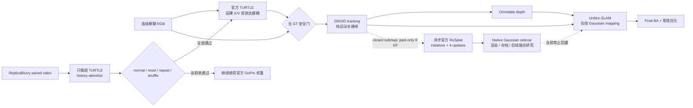

# Unblur-SLAM 改进架构（PPT 单页版）

## 一张图

## PPT 配套四句话

1. **视频前端**：用官方 TURTLE 的递归 K/V 状态替代单图 EVSSM；时刻 `t` 只使用 `0..t`。
2. **在线 SLAM**：TURTLE 每帧更新，DROID 仅按运动选择关键帧；安全门不读取 GT。
3. **离线/后台增强**：子图关闭后，把过去 8 个关键帧异步送入官方 ReSplat，执行一次 initializer 和 4 次 recurrent update。
4. **安全边界**：ReSplat 结果当前只作为 native sidecar；没有把它伪装成对 Unblur 任意 Gaussian map 的原位更新。

## 当前实验结论（2026-08-22）

- TURTLE FP16：`228.18 -> 110.09 ms/frame`，约 `4.38 -> 9.08 FPS`；仍不是 30 FPS 实时。
- ReplicaBlurry 三 seed：真实顺序相对 shuffle 仅 `+0.0181 dB`，微调带来的 history interaction 仅 `+0.0058 dB`，未过预注册门；部署仍用官方 GoPro 权重。
- selection-independent TUM 221-frame smoke：纯运动关键帧为 `9` 个，full-trajectory ATE RMSE `0.001889 m`；GT 只在选择冻结后读取。
- 由其中 8 个 motion-only context 驱动的官方 ReSplat：单个 held-out target 上 init0→refine4 为 `+5.205 dB / +0.051 SSIM / -0.080 LPIPS`；这只是接口 smoke，不是论文统计。
- 本轮按要求不做 26K 与 ReSplat 的公平比较。

## PPT 页脚建议

> Official TURTLE streaming frontend + motion-only SLAM selection + asynchronous official ReSplat closed-submap sidecar. ReSplat output is not merged into the active map in the current version.
